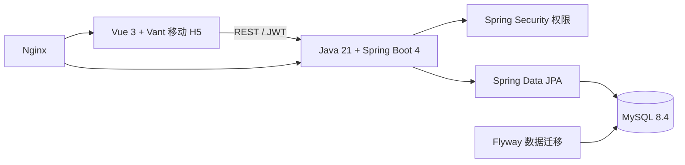

<div align="center">

# ZhuaTech ERP

### 知华科技企业资源管理社区源码版

把销售、采购、库存、客户供应商和应收应付，装进一个前后端分离的移动经营工作台。

[](backend/pom.xml)
[](backend/pom.xml)
[](frontend/package.json)
[](compose.yaml)
[](LICENSE)

**[知华科技官网](https://www.zhuatech.cn/)** · 上海如静知华信息科技有限公司

</div>

## 企业级增强：银行自动对账

新增银行流水与总账分录的一对一确定性匹配、金额和日期容差、歧义识别、未达项及余额差异检查，详见[企业级银行自动对账](docs/ENTERPRISE_BANK_RECONCILIATION.md)。

## 企业级增强：ERP 期间关账治理

新增子账簿对账、未过账凭证、内部往来抵销、银行对账、税务复核和负责人签署联合门禁，详见 [期间关账治理](docs/ENTERPRISE_PERIOD_CLOSE.md)。

## 企业级增强：供应商付款批次

新增三单匹配、重复发票、银行账户、资金计划、审批矩阵、职责分离、支付签名、幂等和回执对账治理，详见[供应商付款批次治理](docs/ENTERPRISE_VENDOR_PAYMENT_BATCH.md)。

## 企业级增强：手工总账凭证过账

新增期间、借贷平衡、科目、核算维度、来源附件、重复凭证、内部往来、税务、分级审批、职责分离、汇率版本和审计证据联合门禁，详见[手工总账凭证治理](docs/ENTERPRISE_MANUAL_JOURNAL_POSTING.md)。

> [!CAUTION]
> **本工程仅允许自然人用于个人、非商业性的学习、研究与技术交流，不得商用。** 企业内部使用、生产环境部署、SaaS、客户交付、商业集成、外包实施、咨询服务、二次开发后销售，以及其他直接或间接产生商业利益的使用，均须事先取得 **上海如静知华信息科技有限公司** 的书面商业授权。请完整阅读 [LICENSE](LICENSE)。

> [!NOTE]
> 本项目属于“社区源码版 / source-available software”。由于许可中包含非商业限制，它不属于 OSI 定义的开源软件。

## 先看产品，而不是先看目录

ZhuaTech ERP 是知华科技面向企业经营管理场景设计的 ERP 基础版本。它用一条可追溯的数据链，把业务从“销售下单”连接到“采购补货、库存出入库和财务核销”。项目适合作为 Java ERP、Spring Boot ERP、Vue ERP、移动 H5 企业管理系统和 MySQL 业务系统的个人学习样例。

## 新增：库存周转健康度

调用 `POST /api/erp/insights/inventory-turnover`，可基于年度销售成本、平均库存、当前库存和安全库存计算周转次数、库存天数与覆盖天数。系统会区分健康、慢动、积压和缺货风险，并输出对应采购与去库存建议。


上图是项目实际运行页面：经营者可以直接看到本期销售额、执行中订单、待处理采购、库存预警、今日出入库和资金敞口。

### 一条业务链覆盖第一版核心场景

```text
客户 / 供应商
      │
      ├── 销售订单 ──→ 销售出库 ──→ 应收与回款
      │
      └── 采购订单 ──→ 采购入库 ──→ 应付与付款
                              │
                              └── 实时库存 / 安全库存 / 盘点调整
```

## 页面实录

以下图片均由本仓库 H5 前端在 390 × 844 手机视口下真实运行后截取。

<table>
  <tr>
    <td width="50%" align="center"><br/><b>品牌登录页</b><br/>演示账号、企业主体和经营数据预览</td>
    <td width="50%" align="center"><br/><b>业务工作台</b><br/>供应链、财务经营和基础资料分区</td>
  </tr>
  <tr>
    <td width="50%" align="center"><br/><b>销售订单</b><br/>订单状态、商品摘要、回款进度和负责人</td>
    <td width="50%" align="center"><br/><b>库存管理</b><br/>库存成本、安全库存、预警与出入库流水</td>
  </tr>
  <tr>
    <td colspan="2" align="center"><br/><b>财务往来</b><br/>应收、应付、费用、核销状态和到期日期</td>
  </tr>
</table>

## 第一版已经具备什么

| 业务域 | 已实现能力 | 关键数据 |
| --- | --- | --- |
| 经营驾驶舱 | 销售、采购、库存和资金指标聚合 | 销售额、执行订单、库存预警、应收应付 |
| 商品中心 | 商品建档、分类、计价和库存策略 | SKU、单位、成本价、销售价、安全库存 |
| 商业伙伴 | 客户与供应商统一管理 | 编码、联系人、地址、信用额度、合作状态 |
| 销售管理 | 销售订单创建与状态流转 | 客户、商品摘要、金额、收款、负责人 |
| 采购管理 | 采购订单创建与履约跟踪 | 供应商、交期、金额、审批和到货状态 |
| 库存管理 | 入库、出库、盘点调整和负库存校验 | 变动前后库存、来源单号、操作人、时间 |
| 智能物料计划 | 汇总现存、预测需求、在途和供应周期，输出短缺优先级 | 预计库存、建议补货量、资金占用、处置建议 |
| 财务往来 | 应收、应付、费用、收款和核销 | 应结金额、已结金额、到期日、往来单位 |
| 账号权限 | JWT 登录和角色级接口控制 | 管理、销售、采购、财务、仓库等角色 |
| 工程部署 | 数据迁移、容器编排和反向代理 | Flyway、MySQL、Docker Compose、Nginx |

## 技术剖面



- 后端根包：`cn.zhuatech.erp`
- 前端：Vue 3、Vite、Vant、Pinia、Vue Router、Axios
- 后端：Java 21、Spring Boot、Spring Security、Spring Data JPA、Jakarta Validation
- 数据库：MySQL 8.4；测试环境使用 H2
- 部署：Docker、Docker Compose、Nginx

架构边界和业务约束见 [docs/ARCHITECTURE.md](docs/ARCHITECTURE.md)，接口清单见 [docs/API.md](docs/API.md)。

## 5 分钟体验

准备 Docker Desktop / Docker Engine 24+ 和 Docker Compose v2：

```bash
cp .env.example .env
docker compose up --build -d
```

访问 <http://localhost:8088>。

| 体验身份 | 用户名 | 密码 | 权限示例 |
| --- | --- | --- | --- |
| 经营经理 | `demo` | `Demo@2026` | 经营、商品、订单、库存和财务 |
| 销售人员 | `sales` | `Demo@2026` | 销售相关业务 |
| 系统管理员 | `admin` | `ZhuaTech@2026` | 全部基础权限 |

首次运行会自动生成商品、客户、供应商、销售订单、采购订单、库存流水和财务往来数据。演示密码与数据只用于个人本地学习；任何联网或获授权的生产部署都必须修改密码、数据库凭据和 `JWT_SECRET`，并移除演示数据。

停止服务：

```bash
docker compose down
```

## 开发模式

后端需要 JDK 21、Maven 3.9 和 MySQL 8：

```bash
cd backend
mvn spring-boot:run
```

前端需要 Node.js 24 和 npm 11：

```bash
cd frontend
npm install
npm run dev
```

默认开发地址为 <http://localhost:5173>，Vite 将 `/api` 代理到 <http://localhost:8080>。如果只希望预览内置 H5 样式，可运行 `npm run dev:demo`；该模式使用前端样例数据，不用于生产。

## 仓库导航

```text
zhuatech-erp/
├── backend/                  # cn.zhuatech.erp Java API
├── frontend/                 # Vue 3 移动 H5
├── docs/
│   ├── images/               # 实际页面截图与咨询二维码
│   ├── API.md
│   └── ARCHITECTURE.md
├── deploy/                   # 部署与上线检查说明
├── compose.yaml
└── README.md
```

## 接下来准备扩展

- [ ] 销售与采购明细行、税率、折扣和多币种
- [ ] 多仓库、库位、批次、序列号与效期管理
- [ ] 销售预测、采购建议和自动补货
- [ ] 总账、会计期间、凭证、成本结转和经营利润表
- [ ] 报价、合同、发票、收付款计划与审批流
- [ ] PC 管理后台、数据权限、审计日志和导入导出
- [ ] 多组织、多账套、多租户和开放 API
- [ ] 企业微信、钉钉、邮件、短信及第三方财税平台集成

## 深度开发、商业授权与私有化部署

本社区源码版适合个人学习 ERP 领域建模、前后端分离架构和企业业务系统设计。若需要用于企业经营、客户项目或其他商业场景，请联系 **知华科技（上海如静知华信息科技有限公司）** 获取书面授权。

可提供的深度服务包括：ERP 业务蓝图、行业功能定制、PC 管理后台、移动端、数据迁移、私有化部署、系统集成、性能治理和长期技术支持。

- 官方网站：**[https://www.zhuatech.cn/](https://www.zhuatech.cn/)**
- 授权主体：**上海如静知华信息科技有限公司**
- 许可全文：[ZhuaTech ERP 社区源码许可协议](LICENSE)

### 微信咨询

任选一个二维码扫码添加微信，可咨询 ERP 商业授权、深度开发、私有化部署和企业数字化解决方案。

<p align="center">
  
  &nbsp;&nbsp;
  
</p>

<p align="center"><b>扫描任一二维码，联系知华科技</b></p>

<details>
<summary>搜索关键词与项目定位</summary>

知华科技 ERP、ZhuaTech ERP、Java ERP 学习项目、Spring Boot ERP、Vue ERP、H5 ERP、MySQL ERP、企业资源管理系统、进销存系统、销售订单系统、采购管理系统、库存管理系统、应收应付系统、ERP 源码、ERP 私有化部署、ERP 二次开发、ERP 商业授权、上海 ERP 定制开发、企业数字化解决方案。

</details>

---

Copyright © 2026 **上海如静知华信息科技有限公司**. All rights reserved.

## 经营现金安全线

本次增加 `POST /api/erp/insights/cash-exposure`。接口用应收、逾期应收、应付、现金余额和月固定成本计算营运资金、逾期比率与现金跑道，并返回 `LOW / MEDIUM / HIGH` 风险等级。逾期催收、十三周现金流和付款节奏建议会随结果一并返回，适合用于财务驾驶舱的预警卡片。

高逾期且现金跑道不足两个月的场景已经纳入自动化集成测试。

## 营运资金周期分析

`POST /api/erp/insights/working-capital` 计算应收周转天数、应付周转天数、库存天数和现金转换周期，自动识别催收、库存或付款节奏问题，为经营驾驶舱提供可追踪的资金效率指标。

## AI 发票异常与应付审计

新增 `POST /api/erp/ai/invoice-anomaly`，对发票金额偏离、重复引用、银行账户变更、采购订单、收货记录、税率和供应商建档时间进行联合检查，输出 `PASS / REVIEW / BLOCK` 与复核证据。基础审计规则开箱即用；配置 DeepSeek 或 OpenAI 兼容模型后，可进一步生成异常解释和审计清单，API Key 由部署方自行保管。

检索关键词：AI ERP、智能财务系统、AI 发票审核、发票异常检测、三单匹配、DeepSeek ERP、应付审计 AI、知华科技 ERP。

## 采购到付款三单匹配

新增 `POST /api/enterprise/erp/procure-to-pay-match`，直接核对采购订单、收货记录和供应商发票的数量、单价、总额、供应商、币种、税务状态与重复发票。容差内返回 `MATCH`；商业偏差进入 `REVIEW`；超收开票、重复发票、供应商或币种不一致返回 `HOLD` 并冻结付款，为后续供应商付款批次提供可解释的前置结果。
